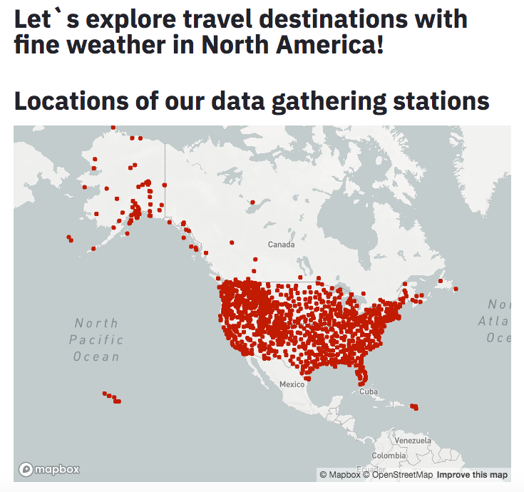

# North America Travel Guide!

TODO: Short abstract describing the main goals and how you achieved them.

Help users find top travel choices in North America. Achieved by interactive data visualization and taking user input to provide suggestions.

## Project Goals

TODO: **A clear description of the goals of your project.** Describe the question that you are enabling a user to answer. The question should be compelling and the solution should be focused on helping users achieve their goals. 

Our goal is to help users identify top travel choices in North America. We are able to help users regardless of whether they know when and where to travel.

## Design

TODO: **A rationale for your design decisions.** How did you choose your particular visual encodings and interaction techniques? What alternatives did you consider and how did you arrive at your ultimate choices?

Visualization 1: Map of data gathering stations.
We designed this map so that users can see where our data is coming from. It also gives them an overall idea about the possible places that we would recommmend to them for traveling. 

Visualization 2: Average measurements for each state given months.
We designed this visualization for users who already have a general idea of where they want to travel to. They could look up the different statistics (temperature, precipitation, wind speed, etc) for their destination. Moreover, they could select different time ranges and compare the statistics to decide when to travel. We originally considered providing 1 month selections instead of range of months, but we decided that users in this category may have friends or relatives at the destination, and hence would need to stay longer.

Visualization 3: Average measurements for each month.
We designed this visualization to help users with undecided travel dates. They could explore this tool to find out when would be the best time to take their vacation.

Visualization 4: Average measurements for different elevations.
We designed this visualization to assist hikers! Exploring this tool allows hikers to decide what range of elevations suits them best.

Visualization 5: Recommend 10 states to travel to given user input.
By now if the user is still unsure where to travel to, we will provide them with recommendations! By telling us the month of their travel and their preferred temperature and precipitation level, we will find the 10 closest states that match their preference during that month, and plot them on the graph to show their temperature and precipitation levels. For this visualization, we originally considered plotting all states on the graph and let the users decide wich one they want to travel to. That became too messy with color coding or with text labeling. Thus, we decided to implement a function that finds the nearest neighbours to the user`s preference, and plot only the top 10.

## Development

TODO: **An overview of your development process.** Describe how the work was split among the team members. Include a commentary on the development process, including answers to the following questions: Roughly how much time did you spend developing your application (in people-hours)? What aspects took the most time?

We came up with the choice of dataset and question together. Xinyi Xu focuesed on Visualization 2-4, and Ruoxin Huang focused on Visualization 1 and 5. We roughly each spent 15 hours, totaling 30 hours. The process of deciding what question to answer and which visualization to use took the most time. 
